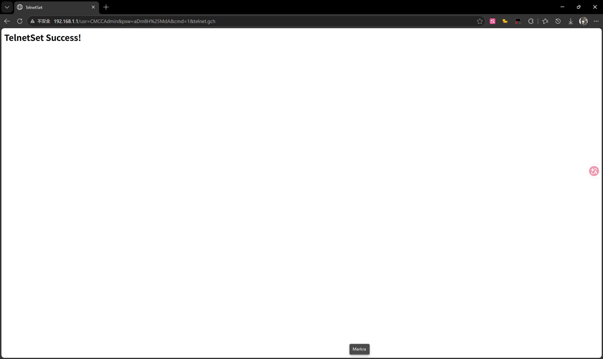

## 前言

> 很早之前就通过一篇文章[^1]知道了如何修改移动光猫的超级管理员密码，很简洁实用。但考虑到随着设备的更新换代，一些步骤可能有所出入，在此做了一些调整并发布。  
> 如有侵权请联系删除。

## 我的设备

- **设备名称**: 10Gbit/s无源光网络用户端设备(X-GPON ONU)
- **设备类型**: 中国移动智能家庭网关 类型十四
- **设备型号**: HX5-4sLite
- **默认终端配置地址**: 192.168.1.1

## 第一步：开启Telnet

直接在连接了网络的设备上访问访问:

   ```
http://192.168.1.1/usr=CMCCAdmin&psw=aDm8H%25MdA&cmd=1&telnet.gch
   ```

   > 会显示：`TelnetSet Success!` 或者 `TelnetSet 开启`



## 第二步：用命令进入 Telnet

在 Windows 电脑上使用 cmd 输入：

```bash
telnet 192.168.1.1
```

> 提示没有Telnet的，在控制面板 > 程序 > 启用或关闭Windows程序 > 启用“Telnet Client”

按照提示输入用户名：`CMCCAdmin` 和密码：`aDm8H%MdA`

> 输入密码不会显示出来，这里可以通过直接右键CMD进行粘贴。

然后输入：

```bash
sidbg 1 DB p DevAuthInfo
```

这时会把所有信息显示出来，这其中有2段：

```xml
<DM name="User" val="******"/>
<DM name="Pass" val="******"/>
```

这个就是需要更改的，只要显示出来这些信息了就行，其他不用管，接着操作就好。

继续输入命令：

```bash
sidbg 1 DB set DevAuthInfo 0 Pass admin
```

这个表示把密码改成：`admin`

然后再输入命令：

```bash
sidbg 1 DB save
```

**现在光猫的超级管理员信息**：
- 用户名：`CMCCAdmin`
- 密码：`admin`

## 第三步：用超级管理员登录

1. 访问: http://192.168.1.1
2. 输入账号: `CMCCAdmin`
3. 输入密码: `admin`

登录进去后就能进行修改了。

[^1]: [移动宽带光猫—获取超级管理员密码教程](https://www.cnblogs.com/fengdongd/p/18094765) - 作者：[fengdong](https://www.cnblogs.com/fengdongd)，日期：2024-03-25 16:45