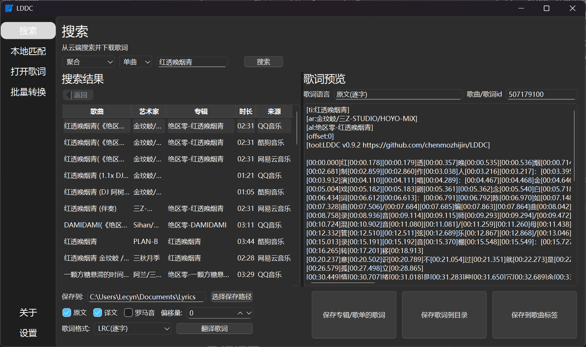
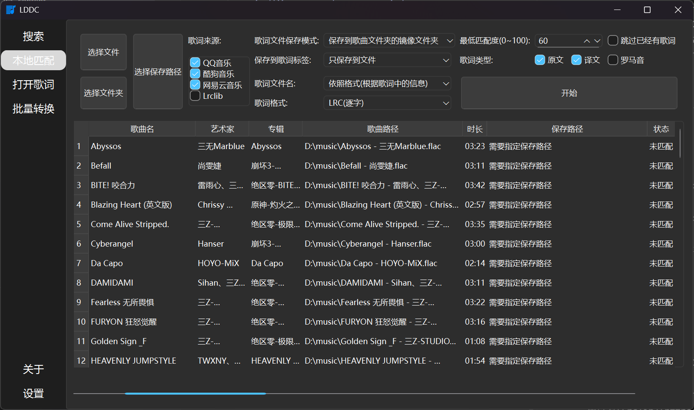

## 1. 项目链接

> 项目仓库：https://github.com/chenmozhijin/LDDC
> 
> 软件下载：https://github.com/chenmozhijin/LDDC/releases/latest
> 
> Wiki：https://github.com/chenmozhijin/LDDC/wiki
> 
> 推荐下载onefile版本，单文件不新增注册表，删掉文件即可完成删除。

## 2. 功能推荐

### a. 歌词搜索

- 全网歌词聚合搜索，包含QQ音乐、酷狗音乐、网易云音乐以及[Lrclib](https://lrclib.net/)。

### b. 歌词匹配

- 支持批量匹配歌词，可选择文件夹或单文件，也支持直接拖拽对应目标进行导入。
- 歌词文件保存模式众多，可选镜像文件夹目录、歌曲所在目录、指定目录（不影响歌词嵌入）。
- 歌词保存方式支持两种，一种是保存为单独歌词文件，一种是嵌入歌曲文件内。
- 可选原文、译文、罗马音三种歌词类型（一般而言译文不支持逐字）

## 3. 总结

这是一款非常便捷及优秀的歌词查找软件，为囤囤党降低了查找歌词的难度。

如果有条件的话不要忘记给原作者点一个小小的[star](https://github.com/chenmozhijin/LDDC)，这将是对原作者最大的鼓励。