> 适用版本：OpenList v4.x | 系统要求：Windows 10/11（64 位）。  
> 该教程仅为新手准备，大佬勿喷。  
> 官网地址：[OpenList](https://doc.oplist.org.cn/)。

## 一、下载 OpenList

1. 打开浏览器，访问 OpenList 的 GitHub 仓库主页：

    ```text
    https://github.com/OpenListTeam/OpenList
    ```

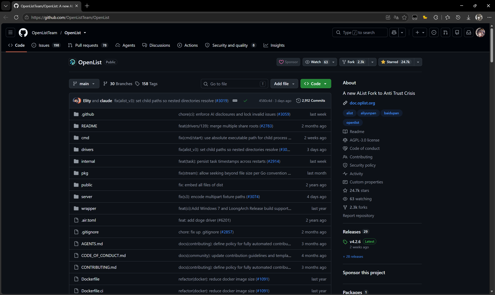

2. 点击页面右侧的 **Releases** 链接，进入版本发布页面。

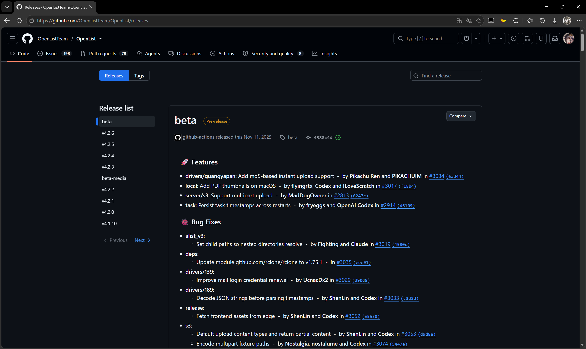

3. 在 Release 列表中，找到最新版本（标记为 **Latest**），在 **Assets** 区域下载适合 Windows 系统的二进制压缩包。

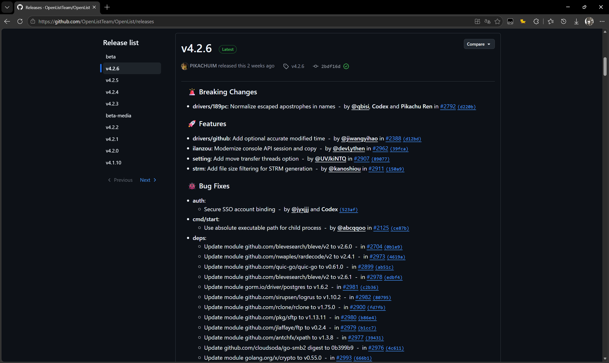

    **如何选择合适的文件：**

    - 大多数现代电脑（Intel/AMD 64 位处理器）：选择 `openlist-windows-amd64.zip`
    - 较老的 32 位系统：选择 `openlist-windows-386.zip`
    - ARM 架构设备：选择 `openlist-windows-arm64.zip`
    - 如果不确定，优先尝试 `amd64` 版本。

## 二、创建文件夹并放入文件

1. 在非系统盘（如 D 盘或 E 盘）创建一个空文件夹，例如：

    ```text
    D:\OpenList
    ```

    > 建议不要放在桌面或 C 盘，避免因系统重装或权限问题导致数据丢失。

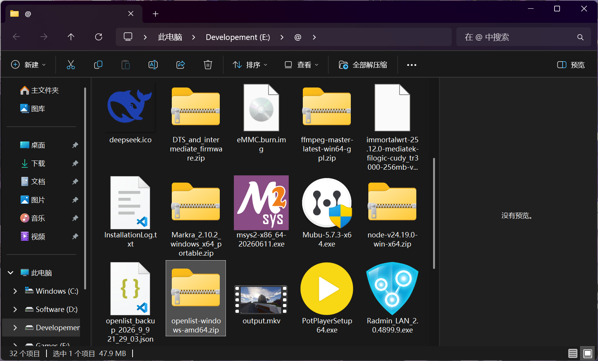

2. 将下载的 `.zip` 压缩包解压，把解压后的所有文件（包括 `openlist.exe`）放入该文件夹中。

    解压完成后，文件夹内应至少包含：

    ```text
    D:\OpenList\
    └── openlist.exe
    ```

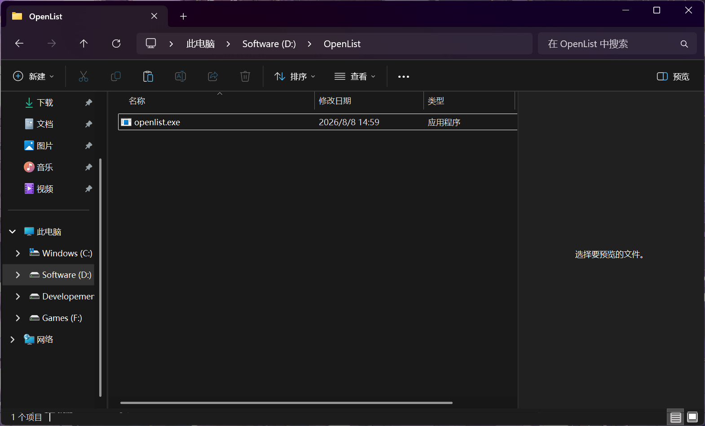

## 三、编写启动脚本（.bat）

在 `D:\OpenList` 文件夹内，新建一个文本文件，将以下内容粘贴进去：

```bat
@echo off
chcp 65001 >nul
echo ============================
echo   OpenList 启动脚本
echo ============================
echo.
echo [网络信息]
ipconfig
echo.
echo ============================
echo   正在启动 OpenList 服务...
echo ============================
openlist server
pause
```

**逐行说明：**

| 命令 | 作用 |
|------|------|
| `@echo off` | 关闭命令回显，让输出更整洁 |
| `chcp 65001` | 将终端编码切换为 UTF-8，防止中文乱码 |
| `ipconfig` | 显示本机网络配置信息，帮助你确认局域网 IP 地址 |
| `openlist server` | 启动 OpenList 服务端 |
| `pause` | 服务停止后暂停窗口，防止闪退看不到信息 |

保存文件，将文件名改为 `启动OpenList.bat`（注意扩展名必须是 `.bat`，不是 `.txt`）。

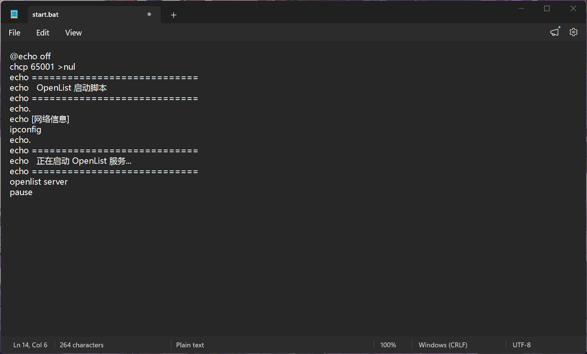

## 四、双击启动并获取登录信息

1. 双击 `启动OpenList.bat`，会弹出一个 CMD 命令窗口。

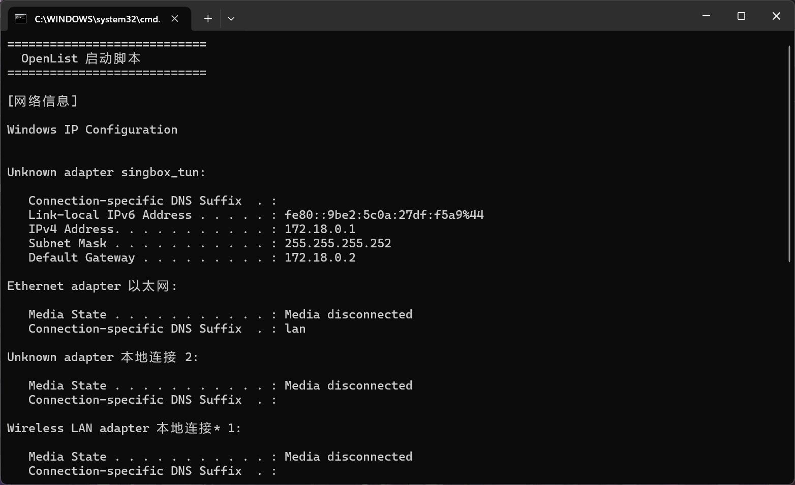

2. 窗口首先会输出 `ipconfig` 的网络信息，包含本机的 IPv4 地址（局域网 IP）。记下这个地址，例如 `192.168.1.187`。

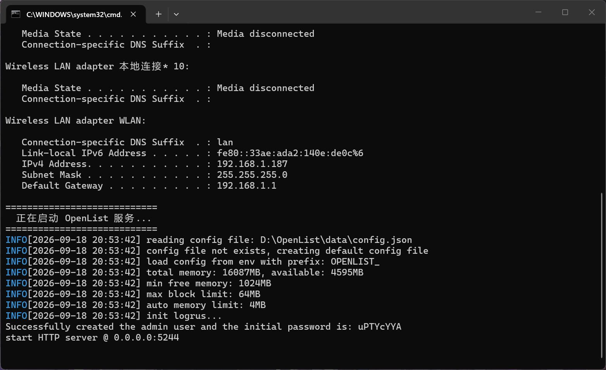

3. 紧接着，OpenList 服务启动，终端会显示如下关键信息：

    ```text
    IPv4 Address: 192.168.1.187
    Subnet Mask: 255.255.255.0
    Default Gateway: 192.168.1.1

    Successfully created the admin user and the initial password is: uPTYcYYA
    start HTTP server @ 0.0.0.0:5244
    ```

    **请务必记录以下两项内容：**

    - **IP 地址**：终端输出的本机 IP（如 `192.168.1.187`），或直接用 `localhost` / `127.0.0.1`
    - **管理员密码**：终端显示的随机初始密码（每次首次启动可能不同，仅首次启动会输出，请牢记，如有遗忘请查看[官方文档](https://doc.oplist.org/faq/howto#%E5%BF%98%E8%AE%B0%E5%AF%86%E7%A0%81%E6%80%8E%E4%B9%88%E5%8A%9E)）

4. 如果窗口一闪而过，说明 `pause` 没有生效或服务启动失败，请检查 `openlist.exe` 是否与 bat 文件在同一目录下。

## 五、登录并进入管理后台

1. 打开浏览器，在地址栏输入：

    ```text
    http://127.0.0.1:5244
    ```

    或使用局域网 IP（同一网络下的其他设备也可访问）：

    ```text
    http://192.168.1.187:5244
    ```

2. 进入登录页面后，输入：

    - **用户名**：`admin`
    - **密码**：第四步中记录的终端密码

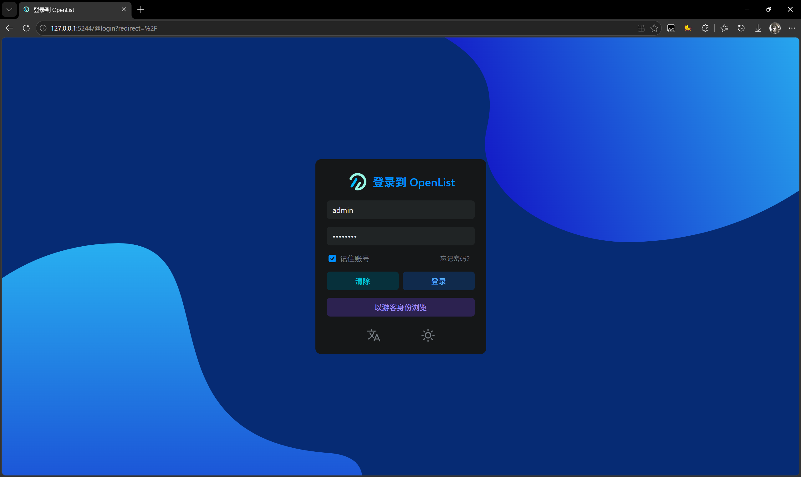

3. 登录成功后，点击页面底部的 **管理** 按钮（或直接访问 `http://127.0.0.1:5244/@manage`），进入管理后台。

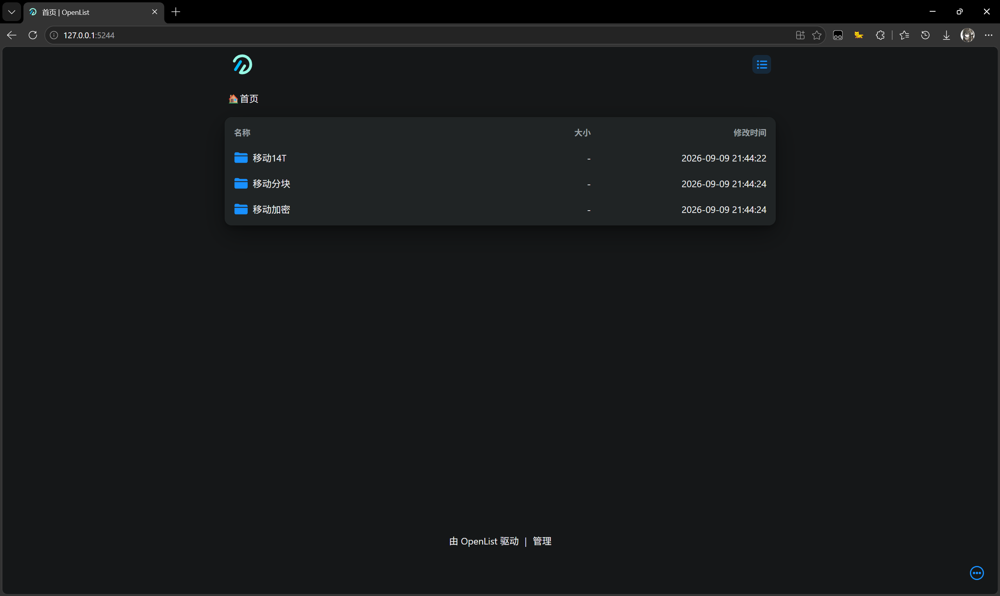

## 六、修改管理员密码

1. 在管理后台中，点击左侧菜单的 **个人资料**（或 **设置 → 个人资料**）。

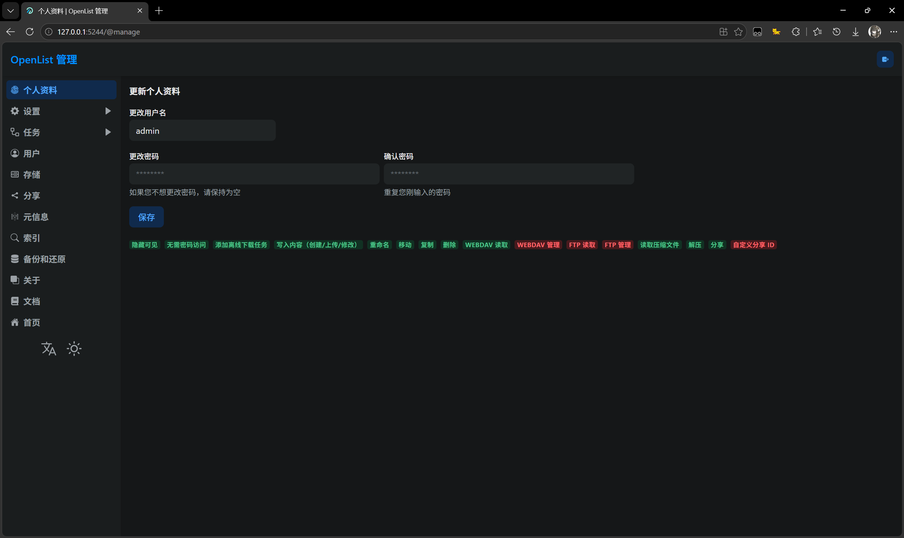

2. 找到 **修改密码** 区域，输入当前密码和新密码。

3. 点击 **保存**，修改完成后需使用新密码重新登录。

## 七、接入网盘（以添加存储为例）

> 请注意，各类网盘的添加以 [官方文档](https://doc.oplist.org/guide/drivers/common) 为准。  
> 官方很多接口为逆向所得，不太稳定，但请勿在出问题后找任何人麻烦。  
> 如果你很厉害可以自己逆向然后去提 [issue](https://github.com/OpenListTeam/OpenList/issues) 或 [PR](https://github.com/OpenListTeam/OpenList/pulls)。

1. 在管理后台左侧菜单中，点击 **存储**。

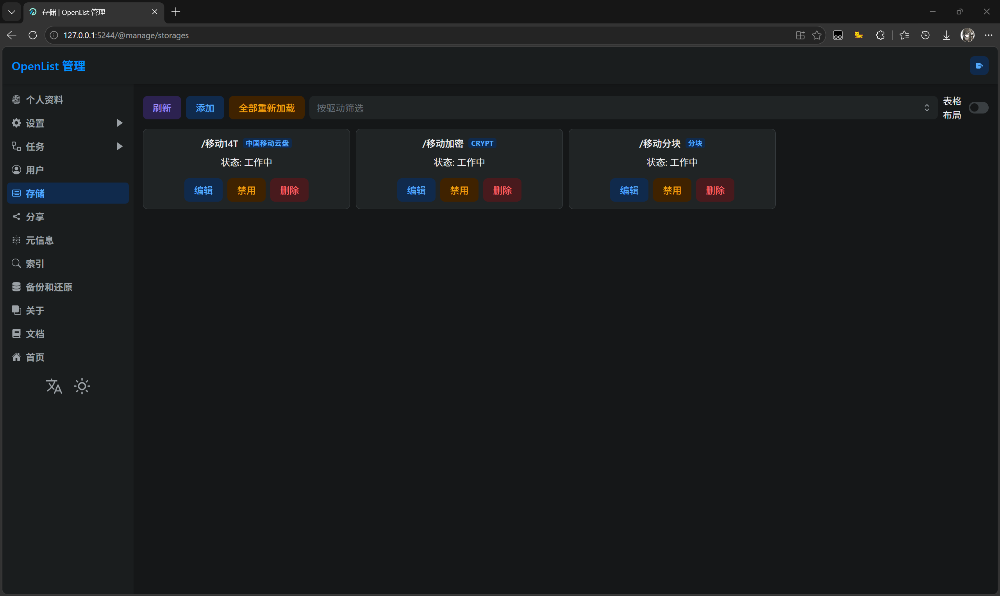

2. 点击右上角的 **添加** 按钮。

3. 在“驱动”下拉列表中，选择你要挂载的网盘类型（如阿里云盘、百度网盘、夸克、OneDrive、本机存储等）。

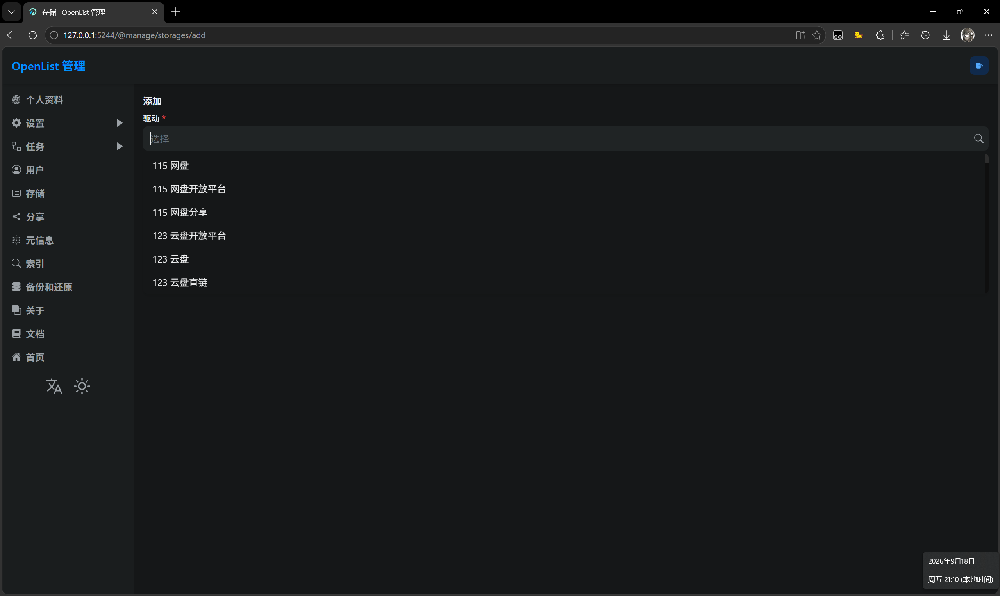

4. 根据所选网盘的要求填写配置参数：

    **以本机存储为例：**

    - **挂载路径**：自定义，如 `/本地文件`
    - **根文件夹路径**：填入本机目录，如 `D:\Files`

5. 填写完成后点击 **保存**，状态显示为 **work** 即表示挂载成功。

6. 返回首页（`http://127.0.0.1:5244`），即可看到已挂载的网盘文件，支持在线预览、播放和分享。

> **提示**：如果挂载后不显示文件，最常见的原因是存储参数填写不正确。建议先添加“本机存储”测试，确认程序工作正常后再添加网盘。

## 八、日常使用

- **启动服务**：双击 `D:\OpenList\启动OpenList.bat`
- **停止服务**：在 CMD 窗口中按 `Ctrl + C`
- **后台管理**：`http://127.0.0.1:5244/@manage`
- **开机自启**：可将 bat 脚本的快捷方式放入 `shell:startup` 文件夹（Win + R 输入 `shell:startup` 回车）